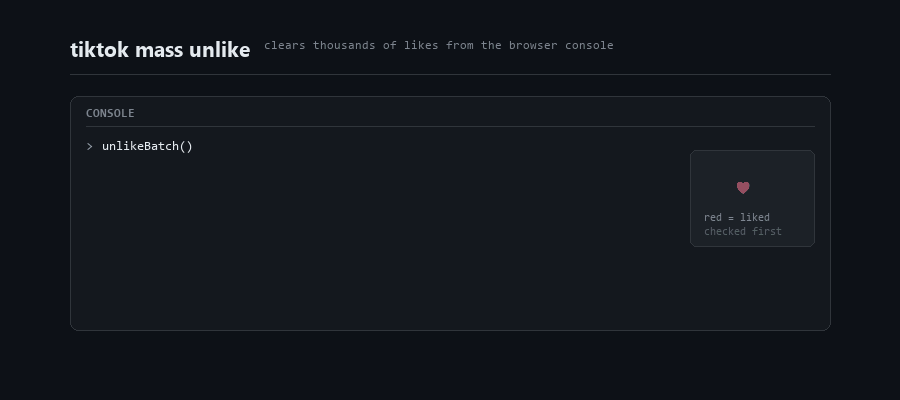

<div align="center">

# TikTok Mass Unlike

**Clear thousands of liked videos from your TikTok account, straight from the browser console.**


</div>

---

TikTok gives you no way to bulk-remove likes. If you've built up thousands over the years, your only option is tapping each heart by hand. This script does the tapping for you.

<p align="center">
  
</p>

> [!CAUTION]
> TikTok rate limits bulk unliking. If the console counter keeps climbing but your liked tab doesn't shrink, your requests are being silently dropped. Stop, wait an hour, and verify before running another batch. Automating actions on your account carries some risk of being flagged. Use at your own risk.

> [!NOTE]
> Web only. The desktop and mobile apps have no console to paste into.

<br>

## Quick start

| | |
|---|---|
| **1** | Go to your profile, open the **Liked** tab |
| **2** | Click the first video so it opens in the player |
| **3** | Press `F12` → **Console** tab |
| **4** | Paste the script below, hit enter |
| **5** | Leave the tab visible and let it run |

<br>

## The script

<details>
<summary><b>Click to expand</b></summary>

<br>

```javascript
/**
 * tiktok-mass-unlike
 * Removes liked videos from your TikTok account via the web UI.
 */

const CONFIG = {
  batchSize: 300,             // videos per run
  heartTimeout: 4000,         // ms to wait for the next video's heart
  clickDelay: 250,            // ms after clicking, lets the unlike register
  advanceDelay: 400,          // ms after pressing ArrowDown
  maxMisses: 5,               // consecutive failures before giving up
  likedColor: '255, 59, 92',  // TikTok red = video is currently liked
};

window.STOP = false;

const sleep = ms => new Promise(r => setTimeout(r, ms));

/**
 * TikTok keeps the liked grid mounted behind the player, so multiple hearts
 * exist in the DOM. Filter to on-screen elements and take the rightmost,
 * which is the player's action bar.
 */
function findHeart() {
  const all = [...document.querySelectorAll(
    '[class*="HeartWrapper"], [data-e2e="like-icon"], [data-e2e="browse-like-icon"]'
  )];

  const visible = all.filter(el => {
    const r = el.getBoundingClientRect();
    return r.width > 0 && r.height > 0 && r.top >= 0 && r.top < window.innerHeight;
  });

  visible.sort((a, b) => b.getBoundingClientRect().left - a.getBoundingClientRect().left);
  return visible[0] || null;
}

/** A red heart means the video is liked. Prevents accidentally re-liking. */
function isLiked(heart) {
  const svg = heart.querySelector('svg') || heart;
  return getComputedStyle(svg).color.includes(CONFIG.likedColor);
}

/** Poll for a red heart rather than sleeping a fixed amount. */
async function waitForRedHeart(maxMs = CONFIG.heartTimeout) {
  const start = Date.now();
  while (Date.now() - start < maxMs) {
    if (window.STOP) return null;
    const heart = findHeart();
    if (heart && isLiked(heart)) return heart;
    await sleep(100);
  }
  return null;
}

function nextVideo() {
  document.dispatchEvent(new KeyboardEvent('keydown', {
    key: 'ArrowDown', code: 'ArrowDown', keyCode: 40, which: 40, bubbles: true,
  }));
}

async function unlikeBatch(limit = CONFIG.batchSize) {
  let count = 0;
  let misses = 0;

  console.log(`starting, target ${limit}. type  STOP = true  to halt`);

  while (count < limit) {
    if (window.STOP) { console.log('stopped by user'); break; }

    const heart = await waitForRedHeart();

    if (heart) {
      misses = 0;
      (heart.closest('button') || heart).click();
      count++;
      console.log(`unliked ${count} / ${limit}`);
      await sleep(CONFIG.clickDelay);
    } else {
      if (window.STOP) break;
      misses++;
      console.log(`no red heart (${misses}/${CONFIG.maxMisses})`);
      if (misses >= CONFIG.maxMisses) {
        console.log('stopping: reached the end, or TikTok is rate limiting');
        break;
      }
    }

    nextVideo();
    await sleep(CONFIG.advanceDelay);
  }

  console.log(`batch done. unliked ${count}`);
  console.log('run  unlikeBatch()  again for another batch');
}

unlikeBatch();
```

</details>

<sub>Can't paste into the console? Type `allow pasting` first, hit enter, then paste.</sub>

<br>

## Controls

```js
unlikeBatch()      // run another batch of 300
unlikeBatch(50)    // run a smaller batch
STOP = true        // stop cleanly after the current video
```

Refreshing the page also kills it instantly.

<br>

## What you'll see

```
starting, target 300. type  STOP = true  to halt
unliked 1 / 300
unliked 2 / 300
unliked 3 / 300
...
batch done. unliked 300
run  unlikeBatch()  again for another batch
```

<br>

## How it works

```
  find the heart in the player
           ↓
  is it red? (= currently liked)
           ↓
  click it, count it
           ↓
  press ArrowDown → next video
           ↓
  poll every 100ms for the next red heart
```

The red check matters: clicking a heart that's already grey would **re-like** the video. Checking the color first makes the script safe to run over a partially-cleared list.

<br>

## Config

| Option | Default | What it does |
|:--|:--|:--|
| `batchSize` | `300` | Videos to unlike per run |
| `heartTimeout` | `4000` | Max ms to wait for the next heart before counting a miss |
| `clickDelay` | `250` | Pause after clicking so the unlike registers |
| `advanceDelay` | `400` | Pause after moving to the next video |
| `maxMisses` | `5` | Consecutive misses before stopping |

<sub>Raise `clickDelay` and `advanceDelay` if unlikes stop registering.</sub>

<br>

## FAQ

<details>
<summary><b>Why not just hit the API directly? That would be way faster</b></summary>

<br>

TikTok's `webmssdk.js` signs every request with `X-Gnarly` and `X-Dynosaur` parameters computed over the full URL, video ID included. A hand-written `fetch` to `/api/commit/item/digg/` comes back with:

```
Web SDK blocked
```

Clicking the real button lets TikTok's own SDK do the signing for us. That's the whole trick, and it's why the UI approach works while direct requests don't.

</details>

<details>
<summary><b>Can I replay a captured request from the Network tab?</b></summary>

<br>

It works for that exact video, then stops. Swap in a different `aweme_id` and the signature no longer matches, because the signature is computed over the full URL.

</details>

<details>
<summary><b>It prints <code>no red heart</code> over and over</b></summary>

<br>

A video needs to be **open in the player**, not the grid of thumbnails. Click into a liked video first.

If a video is open and it still fails, TikTok changed their markup. Inspect the heart element and update the selectors in `findHeart()`.

</details>

<details>
<summary><b>The counter goes up but my likes are still there</b></summary>

<br>

You're rate limited. Stop, wait an hour, then run a smaller batch with larger delays.

</details>

<details>
<summary><b>The same video repeats forever</b></summary>

<br>

The page lost keyboard focus. Click once on the video area, then rerun.

</details>

<details>
<summary><b>Console shows <code>Promise {&lt;pending&gt;}</code></b></summary>

<br>

Normal. The function is async, so the console prints the pending promise immediately. The script is still running, look for the log lines underneath.

</details>

<details>
<summary><b>How long does 10k likes take?</b></summary>

<br>

Roughly an hour per 1000 when the page keeps up, so several hours spread across sessions. Leave it running in a side window.

</details>

<details>
<summary><b>Can it run in a background tab?</b></summary>

<br>

No. Browsers throttle timers in hidden tabs. Keep the window visible, even if it's pushed off to the side.

</details>

<details>
<summary><b>Is there a faster version?</b></summary>

<br>

Not one that works. See the first entry.

</details>

<br>

---

<div align="center">
<sub>Use on your own account. This automates clicks you could make manually. Provided as-is, no warranty.</sub>
</div>
